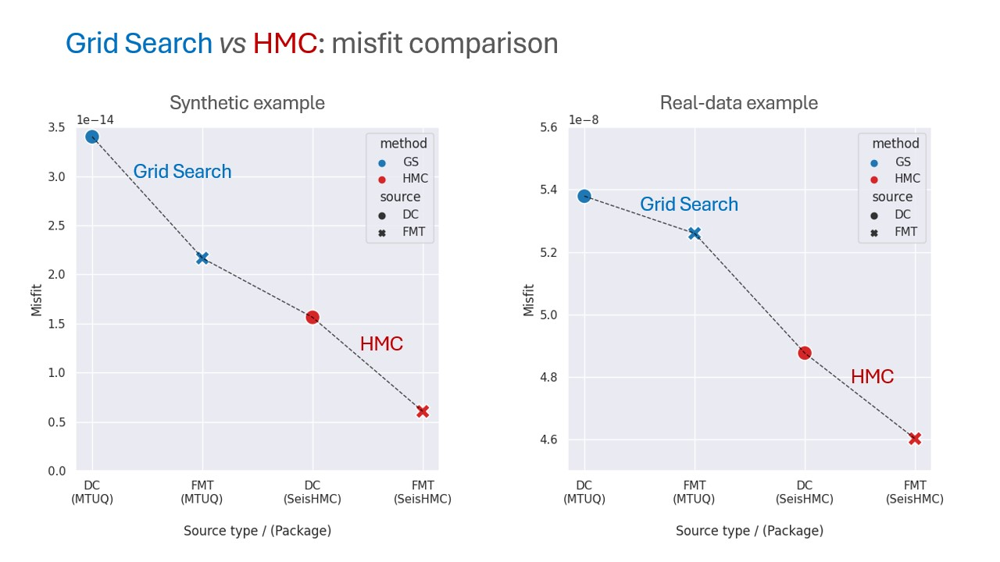

# SEISHMC


SEISHMC is a Python package that is based on [MTUQ](https://github.com/uafgeotools/mtuq) and utilizes **Hamiltonian Monte Carlo** (HMC) algorithm to invert the full moment tensor of earthquake sources.


## Installation

1. Requirements
    * [MTUQ](https://github.com/uafgeotools/mtuq) ([https://github.com/uafgeotools/mtuq](https://github.com/uafgeotools/mtuq))
    * Seaborn (>= 0.11.2) 
    * Numpy
    * Pandas


2. Install seisHMC

* For basic install:
```shell
git clone https://github.com/Liang-Ding/seishmc.git
cd seishmc
pip install -e .
```
* or using pip 
```shell
pip install seishmc
```
## Why HMC?
We achieve lower waveform misfits in our examples using HMC algorithm.


* DC: Double-Couple solution
* FMT: Full Moment Tensor solution
* GS: Grid Search
* HMC: Hamiltonian Monte Carlo algorithm
* *(Grid search is performed using [MTUQ](https://github.com/uafgeotools/mtuq) and HMC sampling is carried out with SeisHMC.)*

## Examples
Overview of many examples provided by SeisHMC.

|                     Synthetic examples                     |                  Real-data examples                   |
|:----------------------------------------------------------:|:-----------------------------------------------------:|
| [GS (DC), syn.](./examples/GridSearch.SYN.DoubleCouple.py) |   [GS (DC)](./examples/GridSearch.DoubleCouple.py)    |
| [GS (FMT), syn.](./examples/GridSearch.SYN.FullMomentTensor.py)  | [GS (FMT)](./examples/GridSearch.FullMomentTensor.py) |
|       [HMC (DC), syn.](./examples/HMC.SYN.DoubleCouple.py)       |      [HMC (DC)](./examples/HMC.DoubleCouple.py)       |
|    [HMC (FMT), syn.](./examples/HMC.SYN.FullMomentTensor.py)     |    [HMC (FMT)](./examples/HMC.FullMomentTensor.py)    |

Check the [gallery](./doc/gallery.md) for more figures and result obtained using HMC algorithm. 


## Tutorials
* [From grid search solver to HMC solver](./doc/gs2hmc.md)

