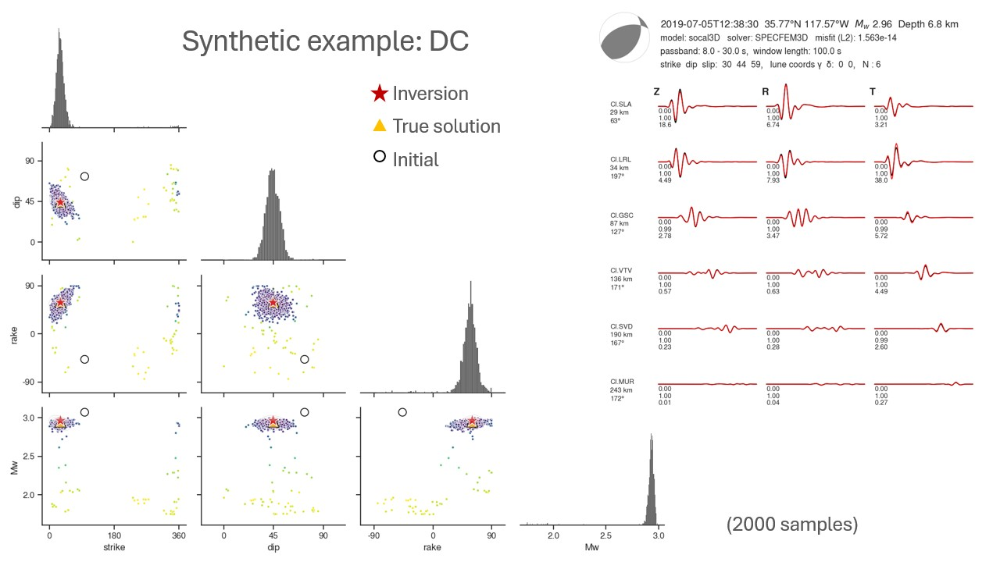
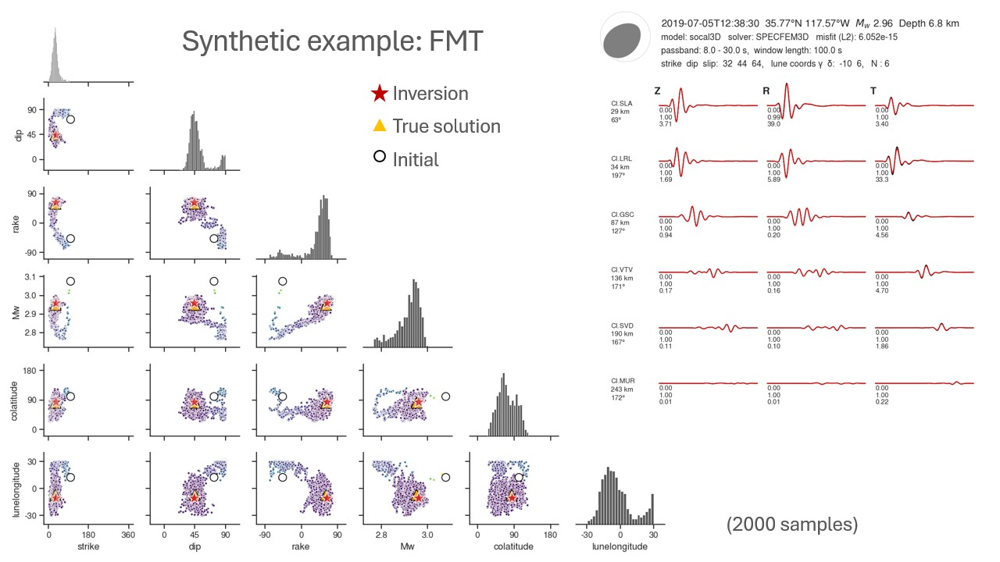
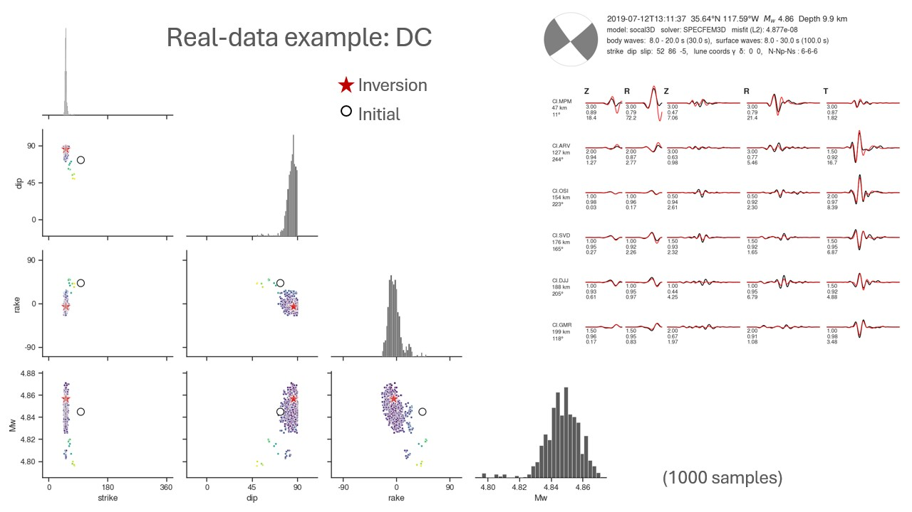
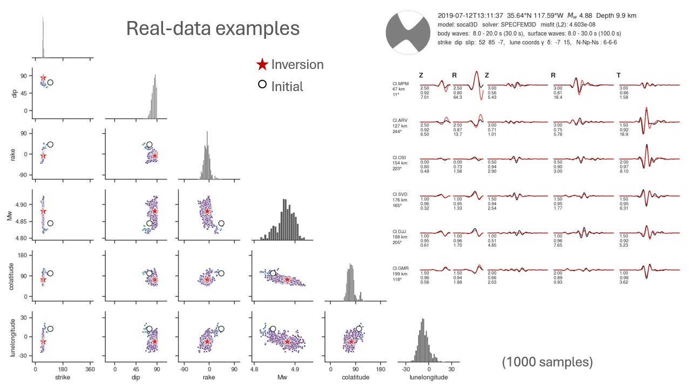

# Synthetic examples
Source parameters utilized in the synthetic examples:

|   Parameter    |     Value |
|:--------------:|----------:|
|    Latitude    | 35.771667 |
|   Longitude    |  -117.571 |
|   Depth (m)    |    6820.0 |
|     Strike     |      30.0 |
|      Dip       |      45.0 |
|      Rake      |      60.0 |
|  Co-latitude   |      83.0 |
| Lune longitude |      -7.0 |
| Magnitude (Mw) |      2.95 |

## Double-couple solution

## Full moment tensor solution

# Real-data examples
## Double-couple solution

## Full moment tensor solution

